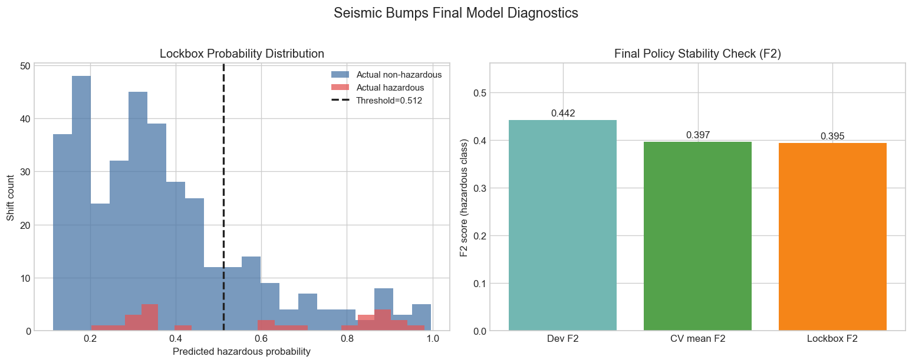
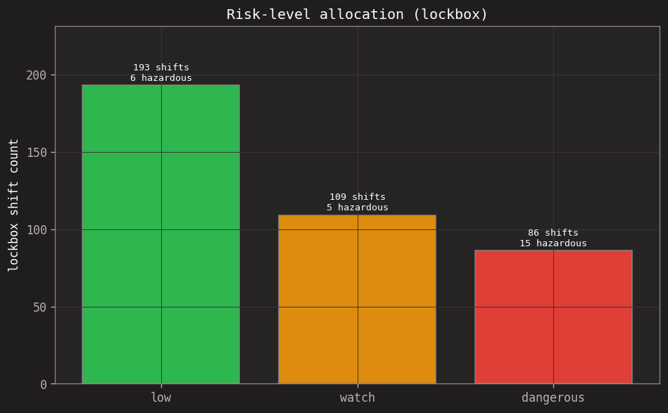

# Seismic Bumps — Hazard Classification

## Problem
This project focuses on coal mine seismic hazard classification using machine learning. The goal is to predict whether the next 8-hour shift will be hazardous based on seismic and seismoacoustic activity.

## What We Are Trying to Find
For each 8-hour shift, we estimate the probability that the **next shift** will have a high-energy seismic bump (hazardous event).

- Input: shift-level monitoring features (hazard assessment, pulse counts, bump counts by energy range, total/max energy, etc.)
- Output: `hazardous` vs `non-hazardous` prediction, plus risk probability for early warning support
- Practical goal: reduce missed hazardous shifts by prioritizing recall/F2 on the hazardous class

- **Dataset**: UCI Seismic Bumps, 2,584 shifts, 18 features.
- **Class Imbalance**: 93.4% non-hazardous, 6.6% hazardous (14.2:1 ratio).
- **Metric Priority**: Recall and F2 score are prioritized over accuracy. In a safety-critical context, missing a dangerous shift (False Negative) is significantly worse than a false alarm (False Positive).

## Dataset
The data is sourced from the UCI ML Repository in ARFF format. Features include:
- **Geographic Origin**: Coal mines in **Poland** (UCI Seismic Bumps source domain).
- **Categorical (Ordinal)**: seismic, seismoacoustic, ghazard (mapped to {a:0, b:1, c:2, d:3}).
- **Categorical (Binary)**: shift (mapped to {N:0, W:1}).
- **Numeric**: energy, maxenergy, and various bump counts (nbumps, nbumps2, etc.).

**Notable finding**: 90% of hazardous events occur on the W (afternoon) shift. Sparse columns like `nbumps5` through `nbumps89` were retained but offer low signal.

## Preprocessing
- **Encoding**: Ordinal encoding for ordered categorical features and binary encoding for shift.
- **Scaling**: `StandardScaler` applied for Logistic Regression and SVM. Random Forest and XGBoost use passthrough for numeric columns.
- **Leakage Prevention**: All preprocessing objects are fit on the training split only and applied to validation and test sets.

## Split Strategy
A stratified 70/15/15 split was used (Train=1808, Val=388, Test=388) with a random state of 42.
**Limitation**: The dataset lacks explicit timestamps, making true temporal validation impossible. Stratified random splitting is used as the best alternative.

## Model Comparison (Test Set Metrics)
Models were evaluated on the test set after selecting optimal thresholds on the validation set using hazardous F2 score.

| Model | Threshold | Haz. Precision | Haz. Recall | Haz. F1 | Haz. F2 | ROC AUC | Accuracy |
| :--- | :--- | :--- | :--- | :--- | :--- | :--- | :--- |
| **logreg** | **0.55** | **0.214** | **0.577** | **0.312** | **0.431** | **0.737** | **0.830** |
| random_forest | 0.50 | 0.355 | 0.423 | 0.386 | 0.407 | 0.763 | 0.910 |
| svm | 0.11 | 0.205 | 0.577 | 0.303 | 0.424 | 0.713 | 0.822 |
| xgboost | 0.32 | 0.119 | 0.692 | 0.203 | 0.353 | 0.778 | 0.637 |

## Best Model
The **Logistic Regression** (logreg) with `class_weight='balanced'` was selected as the winner.
- **Rationale**: Highest validation F2 score (0.412) and strong performance on the test set (F2=0.431, Recall=0.577). It offers a good balance between simplicity, interpretability, and hazard detection.

## Imbalance Experiments
We tested four strategies (default, class_weight_balanced, smote, smote_balanced) on the top models.
- **LogReg**: The `class_weight_balanced` strategy performed best (Val F2=0.412).
- **Random Forest**: The default strategy (no special handling) was most effective (Val F2=0.404).
- **SMOTE Findings**: Synthetic sampling did not improve performance for either model, likely due to the noisy and sparse feature space.

## Why Not Accuracy?
A dummy model predicting all non-hazardous shifts would achieve ~93.4% accuracy but would fail to detect any hazards. Our selected Logistic Regression model has lower accuracy (83%) but successfully identifies 57.7% of hazardous shifts. The F2 score specifically penalizes missed hazards more heavily than false alarms.

## Relevant Graphs

### 1) Final Policy Diagnostics



- **Left panel (Lockbox Probability Distribution):** shows how predicted hazardous probabilities are distributed for actual hazardous and non-hazardous shifts, with the frozen dangerous threshold (`0.512`) as a vertical decision line.
- **Right panel (F2 Stability Check):** compares Dev F2, CV mean F2, and Lockbox F2 to inspect generalization stability and overfitting risk.

### 2) Danger Level Trend



- **Left panel:** count of shifts classified as `low`, `watch`, and `dangerous` under the frozen policy.
- **Right panel:** percentage share of each risk level, helping operations estimate expected alert volume.

## Web App Demo

**Live app: [coalmine-seismic-risk.streamlit.app](https://coalmine-seismic-risk.streamlit.app/)**

`Seismic Risk Console` is a Streamlit demo for the frozen final policy. It supports:

- Single-shift scoring through a guided form
- Batch CSV scoring with downloadable predictions
- Model evidence for the selected threshold, recall, F2, and AUC
- A methodology view explaining dataset limits and safety-focused metrics

Run locally (app only):

```bash
python3 -m venv .venv
source .venv/bin/activate
pip install -r requirements.txt
streamlit run streamlit_app.py
```

`requirements.txt` is the lean runtime set (Streamlit, pandas, numpy, scikit-learn).
The frozen model bundle is pure scikit-learn, so the demo needs nothing heavier.

For training, evaluation, and tests, also install the dev tooling:

```bash
pip install -r requirements-dev.txt   # includes requirements.txt + xgboost, matplotlib, etc.
```

### Deploying to Streamlit Community Cloud

1. Push this repo to GitHub.
2. On [share.streamlit.io](https://share.streamlit.io), create an app pointing at this repo (branch `master`).
3. Set the entrypoint to `streamlit_app.py` and the subdomain to `coalmine-seismic-risk`. The platform installs `requirements.txt` automatically.

Streamlit is a long-running Python server, so it is **not** a fit for static or serverless
hosts like Vercel/Netlify. Use Streamlit Community Cloud (above) or any host that runs a
persistent process (Render, Railway, Fly.io, Hugging Face Spaces).

## Reproducing
Install the dev dependencies first (`pip install -r requirements-dev.txt`), then run the full pipeline:
```bash
# Run Exploratory Data Analysis
python3 scripts/run_eda.py

# Train baseline Logistic Regression
python3 scripts/train_logreg_baseline.py

# Train and evaluate all models
python3 scripts/train_all_models.py

# Run imbalance strategy experiments
python3 scripts/run_imbalance_experiments.py
```

## Project Structure
- `artifacts/`: CSV files with metrics and experiment results.
- `docs/`: Conceptual documentation and diagrams.
- `scripts/`: Python scripts for running the pipeline.
- `src/`: Modular code for loading, preprocessing, splitting, and training.
